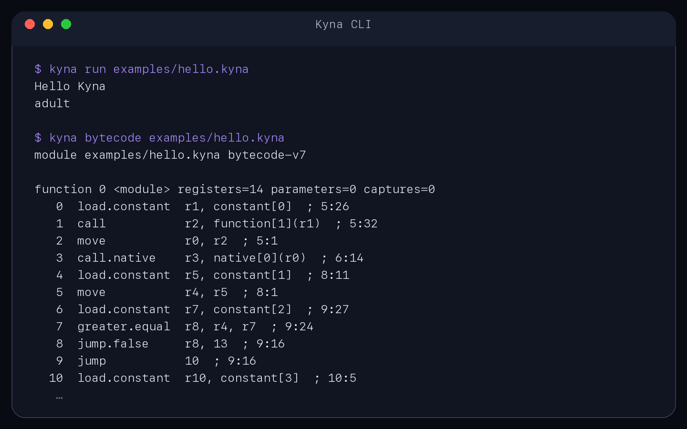

# Kyna

<p align="center">
  
</p>

<p align="center"><strong>A small, strongly typed language for readable scripts and language-tooling experiments.</strong></p>

<p align="center">
  <a href="https://github.com/Up-to-code/Kyna/releases">Releases</a> ·
  <a href="docs/language-spec.md">Language specification</a> ·
  <a href="editors/vscode-kyna/README.md">VS Code extension</a>
</p>

Kyna is a brace-delimited programming language and cross-platform developer platform. Its primary command is `ky`; the earlier `kyna` command remains a supported compatibility alias throughout 1.x. Kyna combines familiar scripting syntax with static types, structured diagnostics, projects, formatting, backend HTTP services, modules, classes, lexical closures, and an inspectable compiler pipeline.

<p align="center">
  
</p>

> [!IMPORTANT]
> Kyna is under active development toward 1.0. The validated bytecode VM runs the supported lowered subset; a temporary tree-walk compatibility engine handles constructs that have not yet moved to bytecode. See the [implementation status](docs/implementation-status.md) and [roadmap](ROADMAP.md) before depending on Kyna for production work.

## Why Kyna?

- **Readable language basics:** explicit bindings, functions, classes, interfaces, modules, exceptions, and familiar control flow.
- **Useful scripting capabilities:** Unicode text, JSON, collections, files, processes, HTTP(S), and parameterized PostgreSQL queries.
- **Compiler visibility:** inspect tokens, syntax trees, HIR, MIR, and validated register bytecode from the CLI.
- **Actionable errors:** stable diagnostic codes, precise source spans, recoverable parsing, and text or JSON output.
- **Embeddable runtime:** host operations are injected behind capability interfaces, with managed memory and explicit GC statistics.
- **Editor support:** syntax highlighting, completion, navigation, live diagnostics, CodeLens, and Run/Check actions for VS Code.

## Quick start

### Install globally

Install a checksum-verified native release for the current user—no repository clone, Docker, CMake, C++ compiler, administrator account, or `sudo` required:

```sh
curl -fsSL https://github.com/Up-to-code/Kyna/releases/latest/download/install.sh | sh
```

On Windows PowerShell:

```powershell
irm https://github.com/Up-to-code/Kyna/releases/latest/download/install.ps1 | iex
```

The Unix installer places `ky` and its `kyna` compatibility alias in `~/.local/bin`. Windows uses `%LOCALAPPDATA%\Kyna\bin` and updates the user PATH when necessary. Both installers support an exact `--version`, an alternate `--prefix`, non-interactive use, checksum verification, atomic replacement, and a previous-version backup. Preview releases require an explicit version and never masquerade as stable.

Open a new terminal if the installer changed your PATH, then verify the installation:

```sh
ky --version
ky doctor
```

If a Unix shell cannot find `ky`, add the default installation directory to your shell profile and reopen the terminal:

```sh
export PATH="$HOME/.local/bin:$PATH"
```

Create, check, format, and run a complete project without cloning this repository:

```sh
ky new hello --template minimal
cd hello
ky check
ky fmt --check
ky run
```

For a guided, Bun-style setup, run `ky new` with no arguments in an interactive terminal. The wizard asks for the project directory, lets you select `minimal` or `backend` with the arrow keys, initializes Git when available, and prints the exact next commands. Automation remains deterministic: pass the name and template explicitly, or use `--no-interactive`.

Create an HTTP backend instead:

```sh
ky new hello-api --template backend
cd hello-api
ky dev
```

The generated service binds to `127.0.0.1:3000` by default and exposes `GET /health`. Use `ky serve --host 0.0.0.0 --port 8080` only when an explicit public/container binding is intended.

Pin a particular stable release on Unix:

```sh
curl -fsSL https://github.com/Up-to-code/Kyna/releases/download/v1.0.0/install.sh | sh -s -- --version 1.0.0
```

Or in Windows PowerShell:

```powershell
& ([scriptblock]::Create((irm https://github.com/Up-to-code/Kyna/releases/download/v1.0.0/install.ps1))) -Version 1.0.0
```

Replace `1.0.0` with an available release. Preview builds must use their exact version together with `--channel preview` on Unix or `-Channel preview` on Windows. Release archives, checksums, signatures, provenance, and the VSIX are published on the [Releases page](https://github.com/Up-to-code/Kyna/releases).

### Build from source

#### Requirements

- CMake 3.25 or newer
- Python 3.10 or newer
- A C++23 compiler
- libcurl development headers
- Git and an internet connection when CMake needs to fetch a missing pinned dependency

PostgreSQL support is enabled when libpq is available. For a fully pinned dependency build, use the included [`vcpkg.json`](vcpkg.json); the default developer preset can otherwise fetch CLI11, FTXUI, and utf8proc when they are missing.

#### Build and test

```sh
git clone https://github.com/Up-to-code/Kyna.git
cd Kyna
cmake --preset debug
cmake --build --preset debug
ctest --preset debug
```

#### Install the CLI and VS Code support from source

Install both from source in one command:

```sh
make install-all
```

By default, the CLI is installed as `~/.local/bin/ky` with `~/.local/bin/kyna` as its compatibility alias, and the packaged language extension is installed into VS Code. Choose another CLI prefix or VS Code executable when needed:

```sh
make install-all PREFIX=/usr/local VSCODE=code
```

Ensure the selected `PREFIX/bin` directory is on your `PATH`. To install only one component, use `make install` for the CLI or `make vscode-install` for the language extension.

CI runs the project on Linux, macOS, and Windows. Release and sanitizer presets are also available:

```sh
cmake --preset release
cmake --build --preset release

cmake --preset sanitizers
cmake --build --preset sanitizers
ctest --preset sanitizers
```

#### Run Kyna

```sh
./build-debug/bin/ky run examples/hello.kyna
./build-debug/bin/ky check examples/hello.kyna
./build-debug/bin/ky repl
```

On Windows, use the executable produced in the selected preset's build directory. Prebuilt platform archives are available on the [Releases page](https://github.com/Up-to-code/Kyna/releases); verify their checksums before running them.

## Language tour

```kyna
func greet(name: str): str {
    return "Hello " + name;
}

let visits: int = 1;  # mutable, with a locked type
visits = visits + 1;

set audience = if (visits > 1) {  # immutable
    "returning visitor"
} else {
    "new visitor"
};

console.log(greet("Kyna"), audience);
```

Kyna deliberately uses `let` for mutable bindings and `set` for immutable bindings. Types are inferred when safe, can be written explicitly, and are non-nullable by default. Add `?` when a value may be `null`:

```kyna
let nickname: str? = null;
```

Modules expose only explicitly exported declarations:

```kyna
import "./math.kyna" as math;

console.log(math.add(20, 22));
```

The language also supports first-class functions, mutable and transitive lexical captures, recursion, single inheritance, structural interfaces, exhaustive `match`, and typed `try`/`catch`/`finally`. Browse the runnable [`examples/language/`](examples/language/) programs or read the complete [language specification](docs/language-spec.md).

## Command-line tools

| Command | Purpose |
| --- | --- |
| `ky new <name> [--template minimal\|backend]` | Create a project; an interactive terminal can select the template. |
| `ky init [path] [--template minimal\|backend]` | Initialize an empty directory without overwriting unrelated files. |
| `ky generate route <name>` | Create an Express-style backend route and register it automatically. |
| `ky run [entry]` / `ky check [entry]` | Run or check an explicit file or the nearest project manifest entry. |
| `ky fmt [paths...]` | Format recursively; use `--check` in CI or `-` for stdin/stdout. |
| `ky dev` / `ky serve` | Watch and restart a checked backend, or serve it once. |
| `ky add`, `ky remove`, `ky install [--locked]` | Manage Git or local-path dependencies and deterministic `kyna.lock`. |
| `ky doctor` | Diagnose the CLI, PATH, manifest, cache, editor, and server setup. |
| `ky self update` / `ky self uninstall` | Manage a per-user installation. |
| `ky repl`, `tokens`, `ast`, `hir`, `mir`, `bytecode`, `inspect` | Use the REPL or inspect compiler stages. |

`ky program.kyna` is shorthand for `ky run program.kyna`. Commands search upward for `kyna.toml`, keep stdout scriptable, render interactive UI on stderr, honor `NO_COLOR`, and support `--no-interactive`, `--quiet`, and `--json`. Exit codes are stable: `0` success, `1` program/check failure, `2` usage/configuration/resolution failure, and `130` interruption.

The interactive `ky repl` includes editable Unicode input, left/right and word movement, Home/End, command history with Up/Down or Ctrl+P/N, reverse history search, mouse cursor placement, deletion shortcuts, lossless multi-line paste, and multiline cancellation. A separate animated purple status bar shows the detected workspace or initialized project without moving the editable input row. Type `:` for a live command list and press Tab to complete a command. Use `:project` for the manifest name, version, template, entry point, and root; press F1 or enter `:keys` for controls, `:help` for REPL commands, and `:history` for submitted lines. Rich terminal features are disabled automatically for pipes and with `--no-interactive` so automation remains deterministic.

Project dependencies are pinned in `kyna.lock`, cached per platform, and never execute dependency-provided install scripts. Store secrets in environment variables rather than `kyna.toml`; the backend template includes `.env.example` and ignores `.env`.

## Standard library and host capabilities

Kyna includes APIs for:

- Unicode-aware text and mutable collection operations
- JSON parsing, serialization, and file storage
- Filesystem and process access
- HTTP and HTTPS client requests through libcurl
- Loopback-safe HTTP servers and routers through an injected Boost.Asio/Beast host capability
- In-memory CRUD stores
- Parameterized PostgreSQL queries through libpq
- Explicit garbage collection and heap statistics

Filesystem, process, network, database, and timing operations cross injected host-capability boundaries, allowing embedders and tests to replace them. Network requests verify TLS certificates and apply timeouts and bounded retries. Review the [standard-library guide](docs/stdlib.md), [runtime guide](docs/runtime.md), and [database guide](docs/database.md) for the available APIs and security considerations.

End-to-end examples are organized under [`examples/`](examples/):

- [`examples/language/`](examples/language/) covers bindings, nullability, closures, exceptions, objects, collections, interfaces, inheritance, and Unicode text.
- [`examples/modules/`](examples/modules/) demonstrates explicit imports and exports.
- [`examples/weather_api.kyna`](examples/weather_api.kyna) calls the keyless Open-Meteo API.
- [`examples/fake_api_store.kyna`](examples/fake_api_store.kyna) demonstrates HTTP CRUD and JSON persistence.
- [`examples/backend/`](examples/backend/) shows parameterized PostgreSQL access and a repository-module seam.

## VS Code extension

Package and install the local extension from the repository root:

```sh
make vscode-package
code --install-extension editors/vscode-kyna/kyna-language-support-1.0.10.vsix --force
```

The extension recognizes `.kyna` files and provides highlighting, snippets, completion, symbols, same-file definitions, hover information, import completion, live diagnostics, CodeLens, document formatting, and commands for running, checking, and inspecting compiler output. It prefers `ky`, falls back to `kyna`, and retains `kyna.executable` for configuration compatibility.

See the [extension README](editors/vscode-kyna/README.md) for development and privacy details.

## Documentation

| Area | Documentation |
| --- | --- |
| Language | [Specification](docs/language-spec.md) · [Grammar](docs/grammar.md) · [Type system](docs/type-system.md) · [Object model](docs/object-model.md) |
| Compiler and runtime | [Architecture](docs/architecture.md) · [Source layout](docs/source-layout.md) · [Runtime](docs/runtime.md) · [Garbage collection](docs/garbage-collection.md) |
| Using Kyna | [Projects](docs/projects.md) · [Modules](docs/modules.md) · [Standard library](docs/stdlib.md) · [Database](docs/database.md) · [Diagnostics](docs/diagnostics.md) |
| Development | [Testing](docs/testing.md) · [Distribution](docs/distribution.md) · [Release policy](docs/release-policy.md) · [GitHub language recognition](docs/github-language-recognition.md) |
| Project status | [Implementation status](docs/implementation-status.md) · [Roadmap](ROADMAP.md) · [Changelog](CHANGELOG.md) |

## Repository layout

```text
compiler/   lexer, parser, analysis, HIR, MIR, and bytecode
runtime/    host-capability interfaces and bytecode VM
library/    core, collection, text, and database support
sdk/        public C++ embedding API
tools/      CLI and development utilities
editors/    VS Code extension
examples/   runnable Kyna programs
tests/      compiler, runtime, standard-library, and tooling tests
docs/       language and architecture documentation
```

## Contributing

Read [`CONTRIBUTING.md`](CONTRIBUTING.md) before opening a pull request. Please report security vulnerabilities privately by following [`SECURITY.md`](SECURITY.md), not through a public issue.

## License

Kyna is available under the [MIT License](LICENSE).
