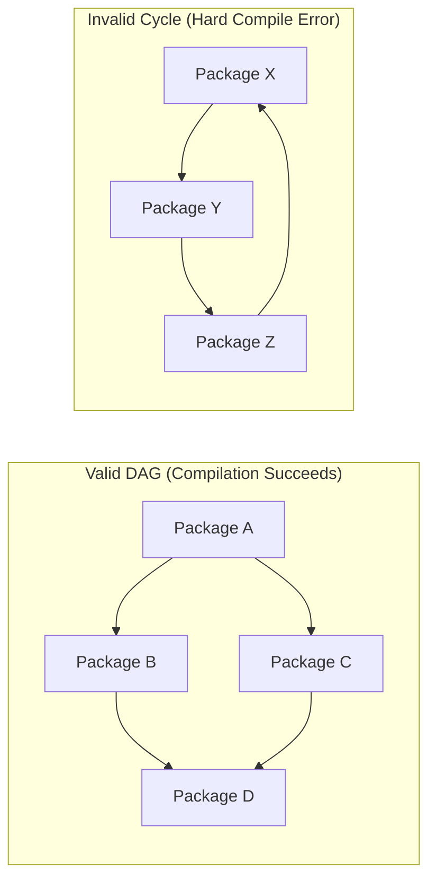

# 01. Repository and Package Architecture

## 1. The Official Go Repository Layout

The Go repository (`/Users/ahmedmansour/Documents/go`) is organized with extreme intentionality. Unlike typical projects that fragment code across dozens of arbitrary top-level folders, Go maintains a lean, predictable top-level layout:

```text
go/
├── api/            # Versioned public API dumps (go1.21.txt, go1.22.txt) for backward-compatibility verification
├── doc/            # Canonical language specification, release notes, and contributor documentation
├── lib/            # Time zone database files and runtime support tables
├── misc/           # Editor plugins (vim, emacs), cgo examples, and auxiliary scripts
├── src/            # THE SOURCE ROOT: standard library, runtime, compiler, and core CLI tools
│   ├── cmd/        # Command-line tools (compiler, linker, assembler, go tool, vet, gofmt)
│   ├── internal/   # Standard library internal helper packages (hidden from external imports)
│   ├── runtime/    # Go runtime engine (goroutines, garbage collector, memory allocator, stack management)
│   └── <pkg>/      # 50+ standard library packages (fmt, net, os, io, sync, time, etc.)
└── test/           # Comprehensive compiler validation suites, golden regression tests, and errorcheck tests
```

### Key Structural Invariants

1. **Everything Lives in `src/`**:
   The entire Go ecosystem (standard library, compiler, runtime, CLI tools) originates from a single unified import root: `src/`. When Go compiles `import "fmt"`, it looks for `src/fmt`. When it compiles `import "cmd/compile/internal/syntax"`, it looks for `src/cmd/compile/internal/syntax`. There is no configuration drift between third-party resolution and standard library resolution.
2. **`api/` Enforces the Compatibility Promise**:
   Go guarantees that code written for Go 1.0 will compile and run without modification on any future Go 1.x version. The `api/` directory contains sorted textual signatures of every exported function, type, method, and constant added in each release. The `cmd/api` tool scans the standard library before any release and fails if any existing signature was altered or removed.

---

## 2. Package Structure & Directory Rules

In Go, **the directory is the package, and the package is the directory.**

### Rules Governing Go Packages

1. **One Package per Directory**:
   All `.go` source files in a single directory must declare the exact same package name via `package <name>` at the top of the file. (The sole exception is test files declaring `package <name>_test` for external blackbox testing).
2. **Multi-File Packages Without Forward Declarations**:
   A package can be split across multiple files (`client.go`, `server.go`, `transport.go`, `request.go`, `response.go` in `net/http`). All files in that directory share a single package namespace:
   - Types, functions, constants, and variables declared in one file are visible across all other files in that directory **without any import or header inclusion**.
   - No forward declarations are needed. Order of files does not matter. The compiler treats all files in the directory as a single compilation unit.
3. **Package Naming Conventions**:
   - Short, concise, lowercase, single-word names (e.g., `bytes`, `json`, `syntax`, `walk`).
   - No snake_case (`snake_case`) or camelCase (`camelCase`).
   - Package names should describe what the package provides, not what it contains (e.g. `http`, not `http_utilities`).
   - Do not use generic names like `util`, `common`, or `helper`.

---

## 3. The `internal/` Boundary Rule: Compiler-Enforced Encapsulation

One of Go's greatest architectural inventions for codebases of any size is the **`internal/` package rule**.

### The Problem in Traditional Languages (and Kyna)
In C++, Java, or early language runtimes, declaring a class or function public so that a sibling module can use it inadvertently makes it public to **all users of the library or compiler**. Over time, third parties depend on unstable internals, creating architectural debt and preventing refactoring.

### The Go Solution
Go enforces a hard rule baked directly into the compiler and `go` build tool:

> **The `internal/` Rule**:
> An import path containing the element `internal` is only importable by code rooted in the parent directory of that `internal` directory.

### Visualizing the Boundary

```text
src/
├── net/
│   ├── http/
│   │   ├── internal/
│   │   │   └── ascii/          <-- Can ONLY be imported by net/http and net/http/...
│   │   ├── client.go
│   │   └── server.go
│   └── url/                    <-- CANNOT import net/http/internal/ascii (Hard Compile Error!)
└── myapp/                      <-- CANNOT import net/http/internal/ascii
```

If `net/url` or an external application attempts:
```go
import "net/http/internal/ascii"
```
The compiler halts immediately:
```text
use of internal package net/http/internal/ascii not allowed
```

### How the Go Compiler Implements This
In `src/cmd/go/internal/load/pkg.go`, the package loader checks:

```go
func (p *Package) checkInternal(importer *Package, pos token.Pos) error {
    // Determine the directory enclosing the "internal" directory
    // If importer is not within that parent directory, emit an error
}
```

This simple rule allows Go's standard library and compiler teams to refactor thousands of internal files without risking broken external dependencies.

---

## 4. The `cmd/` Architecture: Separation of Driver from Business Logic

Looking inside `/Users/ahmedmansour/Documents/go/src/cmd`, we see how Go organizes its own toolchain:

```text
src/cmd/
├── compile/                # The Go compiler binary
│   ├── doc.go              # Architecture documentation
│   ├── main.go             # Tiny driver entry point (1,300 bytes)
│   └── internal/           # 52 private packages forming the compiler pipeline
│       ├── syntax/         # Lexer and parser
│       ├── types2/         # Type checker
│       ├── ir/             # Intermediate representation
│       ├── ssa/            # Static single assignment optimizer
│       └── ssagen/         # SSA code generator
├── go/                     # The 'go' build & tool binary
│   ├── main.go             # CLI command router
│   └── internal/           # 45 isolated command packages
│       ├── base/           # Shared Command interface and flag helpers
│       ├── run/            # 'go run' implementation
│       ├── test/           # 'go test' implementation
│       ├── modcmd/         # 'go mod' implementation
│       └── work/           # Build graph execution and caching
├── vet/                    # Static code analyzer
└── gofmt/                  # Source code formatter
```

### The Driver Pattern
Notice that `cmd/compile/main.go` does not contain the compiler logic. It is merely a 50-line entry point that parses global flags and delegates to `cmd/compile/internal/gc.Main()`.

Similarly, `cmd/go/main.go` defines a central command table:
```go
var commands = []*base.Command{
    bug.CmdBug,
    work.CmdBuild,
    clean.CmdClean,
    doc.CmdDoc,
    envcmd.CmdEnv,
    fix.CmdFix,
    fmtcmd.CmdFmt,
    generate.CmdGenerate,
    modcmd.CmdMod,
    run.CmdRun,
    test.CmdTest,
    vet.CmdVet,
    version.CmdVersion,
}
```
Every subcommand is a self-contained package under `cmd/go/internal/<command>`. A subcommand cannot pollute the namespace or state of another subcommand.

---

## 5. Import Graphs and DAG Enforcement

Go strictly prohibits circular dependencies between packages.



### Why Go Enforces a Strict DAG
1. **Linear Compilation Time**: Packages at the leaves of the DAG can be compiled in parallel. Once dependencies are compiled, downstream packages compile without back-tracking.
2. **No Header Re-parsing**: Package A only needs the compiled interface (export data) of Package B. It does not parse B's code.
3. **Clear Conceptual Layering**: Circular dependencies indicate poor design where two components have not properly separated their shared abstraction into a lower-level leaf package.

---

## 6. Actionable Blueprint for Kyna

Kyna's current architecture is based on deep CMake modules (`kyna_lexing`, `kyna_syntax`, `kyna_parsing`, `kyna_typecheck`, `kyna_hir`, `kyna_mir`, `kyna_bytecode`, `kyna_vm`). To achieve Go-level scalability for programs written in Kyna, we should adopt the following enhancements:

### Recommendation 1: Multi-File Packages in Kyna
Currently, Kyna scripts are primarily executed as single files or individual module imports. We should introduce package directories where:
- Running `ky run ./mypackage` compiles all `.kyna` files in that directory as a single namespace.
- Types and functions in `user.kyna` are visible to `service.kyna` without manual import statements.

### Recommendation 2: Semantic Enforcement of `internal/` in Kyna Modules
In Kyna's module analyzer (`compiler/kyna_typecheck/src/checkers/module_analyzer.cpp`):
- Check the import path of any imported module.
- If the import path contains `/internal/`, verify that the importing file's directory is a descendant of the directory containing `internal/`.
- If not, emit diagnostic `KMOD1004: use of internal module '<path>' not allowed`.

### Recommendation 3: Align CLI Commands with `cmd/go`
Refactor `tools/kyna_cli` so that each subcommand (`check`, `run`, `build`, `hir`, `mir`, `bytecode`, `fmt`) is an independent module with its own argument parsing and execution handler, registered through a central table rather than nested branching logic.
