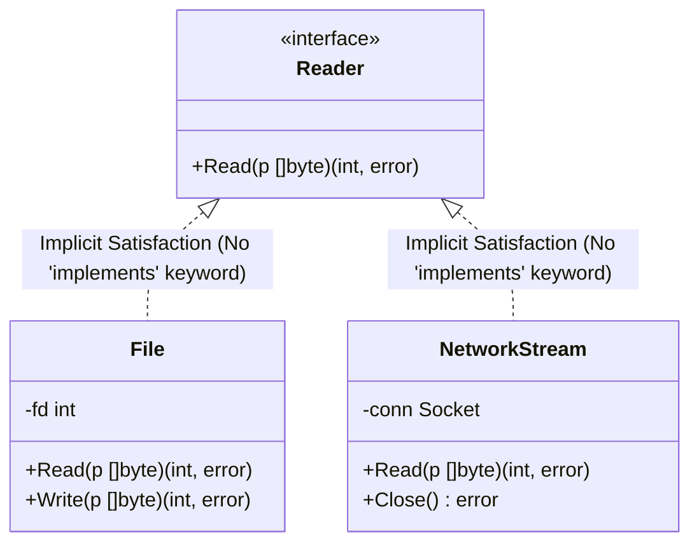

# 03. Type System & Typing Rules Deep Dive

## 1. The Architecture of Go's Type System (`types2` & `go/types`)

In the Go compiler, the type system is isolated into a dedicated package: `cmd/compile/internal/types2` (with an identical public twin in the standard library: `go/types`). 

Instead of treating types as strings or ad-hoc enums, Go models every type as an object implementing the polymorphic `Type` interface (`src/cmd/compile/internal/types2/type.go`):

```go
type Type interface {
	// Underlying returns the underlying type of a type.
	// Underlying types are never Named, TypeParam, or Alias types.
	Underlying() Type

	// String returns a string representation of a type.
	String() string
}
```

### The 14 Fundamental Concrete Types

Each kind of type lives in its own dedicated source file under `types2/`:

```text
types2/
├── basic.go        # Basic: int, float64, bool, string, untyped constants
├── pointer.go      # Pointer: *T (base type)
├── array.go        # Array: [N]T (fixed length + element type)
├── slice.go        # Slice: []T (dynamic view over an array)
├── map.go          # Map: map[K]V (hash table key and value types)
├── chan.go         # Chan: chan T, <-chan T, chan<- T (channel and direction)
├── struct.go       # Struct: fields ([]*Var), tags ([]string)
├── interface.go    # Interface: explicit methods ([]*Func), embedded types ([]Type)
├── signature.go    # Signature: parameters, return results, receiver, variadic flag
├── named.go        # Named: defined type (type X Y) with its own identity and methods
├── alias.go        # Alias: type alias (type X = Y) pointing directly to existing type
├── typeparam.go    # TypeParam: generic type parameter constrained by an interface
├── union.go        # Union: type set terms (T | ~T) inside generic constraints
└── tuple.go        # Tuple: ordered list of variables (multi-return values)
```

### Kyna Implementation Map

The same one-type-per-file architecture is now represented in `compiler/kyna_types` without changing Kyna's existing surface syntax:

| Go `types2` type | Kyna semantic type | Kyna role |
| :--- | :--- | :--- |
| `Basic` | `BasicType` | Interned primitive universe. |
| `Array` | `ArrayType` | Fixed-length value aggregate; length is part of identity. |
| `Slice` | `SliceType` | Dynamic reference descriptor behind `array<T>`. |
| `Map` | `MapType` | Typed key/value associative reference. |
| `Pointer` | `PointerType` | Typed storage reference. |
| `Chan` | `ChannelType` | Send/receive, send-only, and receive-only channel directions. |
| `Struct` | `StructType` | Ordered structural fields, tags, and embedding metadata. |
| `Interface` | `InterfaceType` | Structural method sets and embedded contracts. |
| `Signature` | `SignatureType` | Parameters, result, receiver, and variadic metadata. |
| `Named` | `NamedType` | Nominal identity, underlying type, and value/pointer method metadata. |
| `Alias` | `AliasType` | Alternate spelling with target identity. |
| `TypeParam` | `TypeParam` | Generic parameter with a type constraint. |
| `Union` | `UnionType` | Union members and constraint-style sets. |
| `Tuple` | `TupleType` | Ordered internal parameter/result collection. |

Kyna additionally retains `NullableType` because non-nullability and `T?` are established Kyna language rules rather than Go rules. This layer is the semantic foundation; source syntax, lowering, bytecode, and runtime support must still be added deliberately for constructs that are not already part of the implemented language.

---

## 2. Defined Types vs. Type Aliases

Go maintains a critical distinction between **Defined Types** and **Type Aliases**:

```go
// 1. DEFINED TYPE (Nominal Identity)
type UserID int64

// 2. TYPE ALIAS (Structural Synonym)
type StringList = []string
```

### Semantic Differences

| Feature | Defined Type (`type T U`) | Type Alias (`type T = U`) |
| :--- | :--- | :--- |
| **Identity** | New distinct type. `UserID` is NOT identical to `int64`. | Exact same type. `StringList` IS `[]string`. |
| **Assignments** | Requires explicit conversion: `var id UserID = UserID(42)`. | Implicitly assignable without conversion: `var l StringList = []string{"a"}`. |
| **Method Set** | Gets its own fresh method set. Does not inherit methods from `U`. | Shares the exact same method set as `U`. |
| **Underlying Type** | `UserID.Underlying()` returns `int64`. | `StringList.Underlying()` returns `[]string`. |
| **Use Case** | Domain modeling, type safety, preventing accidental mixing of IDs. | Code refactoring, package migrations without breaking API consumers. |

---

## 3. Structural Interfaces vs. Nominal Structs

Go combines **nominal defined types** with **structural interfaces**:



### Why Structural Interfaces Scale
In traditional languages (Java, C#, early Kyna), a class must explicitly state `implements Reader`. This creates **coupling at definition time**:
- If a third-party library exposes a `Buffer` struct with a `Read([]byte)` method, but didn't import your `Reader` interface, you cannot use their buffer where your interface is expected.
- In Go, `File` and `NetworkStream` implement `Reader` **automatically** simply because they have a matching `Read(p []byte) (n int, err error)` method. The producer does not need to know about the consumer.

### Method Sets & Pointer Receivers in Interface Satisfaction
A type `T`'s method set determines which interfaces it satisfies:
- For a value of type `T`: The method set contains all methods declared with receiver `(t T)`.
- For a pointer of type `*T`: The method set contains all methods declared with receiver `(t *T)` **AND** `(t T)`.

```go
type Closer interface {
	Close() error
}

type Socket struct{}
func (s *Socket) Close() error { return nil }

var s Socket
var c Closer = s  // COMPILE ERROR: Socket does not implement Closer (Close has pointer receiver)
var c Closer = &s // COMPILES: *Socket implements Closer
```

---

## 4. The Assignability Algorithm (`AssignableTo`)

When the compiler checks `x = y` or `funcCall(arg)`, it calls `assignableTo` (`src/cmd/compile/internal/types2/operand.go`):

```go
func (x *operand) assignableTo(check *Checker, T Type, cause *string) (bool, Code)
```

### The 6 Rules of Assignability

1. **Exact Identity**:
   `Identical(V, T)` is true. (e.g. assigning `int` to `int`).
2. **Untyped Constants**:
   `x` is an untyped constant and its numerical value is representable by target type `T`.
   ```go
   var f float64 = 42 // Untyped integer literal 42 implicitly converts to float64 42.0
   ```
3. **Underlying Type Equivalence for Unnamed Types**:
   `Vu == Tu` (identical underlying types), and **at least one of `V` or `T` is an unnamed type literal**:
   ```go
   type Point struct { X, Y int }
   var p Point = struct{ X, Y int }{ 1, 2 } // Allowed: struct literal is unnamed
   ```
4. **Interface Implementation**:
   `T` is an interface and `V` implements `T` (all methods of `T` are present in `V`'s method set with identical parameter and return types).
5. **Channel Direction Subtyping**:
   `V` is a bidirectional channel `chan T`, and `T` is a directional channel `<-chan T` or `chan<- T` with identical element types.
6. **Generic Constraint Satisfaction**:
   `T` is a type parameter and `V` satisfies each specific type in `T`'s type set.

---

## 5. Declaration Checking & Cycle Detection (Tri-Color Algorithm)

In `src/cmd/compile/internal/types2/decl.go`, Go must type-check declarations that may appear in arbitrary order across multiple files in a package:

```go
type A struct { b *B }
type B struct { a *A }
```

### The Tri-Color Stack Algorithm

Go tracks the checking state of every declaration using three colors:

```text
[WHITE] (Unvisited)
   │
   ▼
[GREY]  (Checking in Progress — Pushed onto Checker.objPath stack)
   │
   ▼
[BLACK] (Checking Complete — Type resolved and verified)
```

1. Every top-level symbol starts **WHITE**.
2. When the checker begins analyzing symbol `X`, it marks `X` **GREY** and pushes `X` onto `Checker.objPath`.
3. If during checking `X`, the checker encounters another symbol `Y`:
   - If `Y` is **BLACK**: its type is already known. Use it immediately.
   - If `Y` is **WHITE**: recursively call `objDecl(Y)`.
   - If `Y` is **GREY**: **A cycle is detected!**
4. If a cycle is detected:
   - If the cycle passes through an indirection (e.g. pointer `*B`, slice `[]B`, map `map[string]B`, interface), it is **valid recursion**.
   - If the cycle is direct (e.g. struct embedding: `type Node struct { next Node }`), the compiler halts with a clear diagnostic:
     ```text
     invalid recursive type Node: Node refers to itself
     ```
5. Once `X`'s type is fully resolved, it is popped from the stack and marked **BLACK**.

---

## 6. Comparison: Kyna's Current Type System vs. Go

### Kyna's Current `TypeRef` Model (`compiler/kyna_types`)

In Kyna, types are currently represented by a lightweight struct in `compiler/kyna_types/include/kyna/semantics/type_model.hpp`:

```cpp
struct TypeRef {
  std::string name{"void"};
  bool nullable{false};
  std::vector<TypeRef> typeArgs;
  std::vector<TypeRef> unionTypes;
  std::string str() const;
};
```

### Limitations of Kyna's String-Based Model
1. **No Distinction Between Defined and Underlying Types**:
   Kyna checks types primarily by string comparisons (`name == "int"`). It cannot determine if a user-defined type has an underlying struct or primitive.
2. **Fragile Structural Conformance**:
   Interface matching requires ad-hoc string comparisons against method signatures rather than comparing method sets and signatures as first-class objects.
3. **No Direct Cycle Detection**:
   Without a tri-color traversal stack, complex recursive type definitions risk stack overflows or incomplete resolution.

---

## 7. Blueprint: Upgrading Kyna's Type System to Match Go

To make Kyna's compiler scalable and robust, we will replace the flat `TypeRef` struct with a polymorphic C++ type graph:

```cpp
namespace kyna::semantics {

class Type {
public:
    virtual ~Type() = default;
    virtual const Type* underlying() const = 0;
    virtual std::string str() const = 0;
    virtual bool is_identical(const Type* other) const = 0;
};

class BasicType : public Type {
public:
    enum Kind { Int, Float, Bool, Str, Void, Any };
    BasicType(Kind k) : kind_(k) {}
    const Type* underlying() const override { return this; }
    // ...
private:
    Kind kind_;
};

class StructType : public Type {
public:
    struct Field {
        std::string name;
        std::shared_ptr<Type> type;
        bool exported;
    };
    const Type* underlying() const override { return this; }
    const std::vector<Field>& fields() const { return fields_; }
private:
    std::vector<Field> fields_;
};

class InterfaceType : public Type {
public:
    struct Method {
        std::string name;
        std::shared_ptr<SignatureType> signature;
    };
    const Type* underlying() const override { return this; }
    const std::vector<Method>& methods() const { return methods_; }
private:
    std::vector<Method> methods_;
};

class NamedType : public Type {
public:
    NamedType(std::string name, std::shared_ptr<Type> underlying)
        : name_(std::move(name)), underlying_(std::move(underlying)) {}
    const Type* underlying() const override { return underlying_->underlying(); }
    const std::string& name() const { return name_; }
private:
    std::string name_;
    std::shared_ptr<Type> underlying_;
};

} // namespace kyna::semantics
```

This ensures that type comparisons are $O(1)$ pointer/underlying checks rather than costly string parsing.
