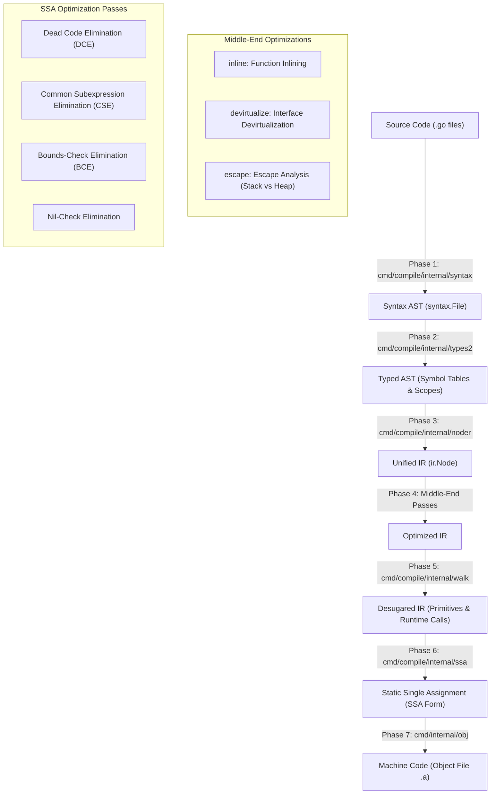

# 04. Data Flow, Parameter Passing & Compiler Pipeline

## 1. How Data is Passed in the Go Runtime

One of Go's fundamental design decisions is that **everything in Go is passed by value**. There is no pass-by-reference at the language level. However, Go uses lightweight "fat pointers" and descriptor headers to achieve zero-copy performance and flexible sharing.

```mermaid
graph TD
    subgraph Data_Passing_Mechanisms ["Data Passing Mechanisms in Go"]
        V["Scalar Values (int, float, bool)"] -->|Direct Copy in Registers| R1["Registers / Stack"]
        S["Slice Header (24 bytes)"] -->|Copy Header (ptr, len, cap)| ARR["Shared Backing Array"]
        STR["String Header (16 bytes)"] -->|Copy Header (ptr, len)| BYTES["Immutable Byte Array"]
        IFACE["Interface Header (16 bytes)"] -->|Copy itab + data_ptr| OBJ["Concrete Value / Heap Object"]
        REF["Maps & Channels"] -->|Copy 8-byte Pointer| HMAP["Runtime *hmap / *hchan"]
    end
```

### 1.1 Slices: 3-Word Fat Pointers
A slice is not an array; it is a 24-byte header (`runtime/slice.go`):
```go
type slice struct {
	array unsafe.Pointer // 8 bytes: pointer to element 0
	len   int            // 8 bytes: current number of elements
	cap   int            // 8 bytes: maximum capacity before reallocating
}
```
- When a slice is passed to a function, the 24-byte header is copied.
- Modifying elements inside the function (`s[0] = 99`) affects the caller because both headers point to the same backing array.
- Appending elements (`s = append(s, 100)`) modifies only the local copy of `len` and `cap`. If the append exceeds capacity, a new backing array is allocated, leaving the caller's slice pointing to the original array.

### 1.2 Strings: 2-Word Immutable Descriptors
A string is a 16-byte header:
```go
type stringStruct struct {
	str unsafe.Pointer // 8 bytes: pointer to underlying immutable bytes
	len int            // 8 bytes: number of bytes
}
```
- Passing a string of 100 megabytes takes only **16 bytes** of stack/register copy.
- Substrings (`s[10:50]`) take $O(1)$ time and allocate **zero memory**; they simply create a new 16-byte header pointing into the existing byte buffer.
- Because string memory is immutable, sharing strings across concurrent goroutines requires no mutexes or locks.

### 1.3 Interfaces: Fat Pointers with Inline Dynamic Dispatch
An interface value in Go consists of two 8-byte pointers:

```text
Non-Empty Interface (iface):
┌───────────────────────────┬───────────────────────────┐
│ *itab (Type & Method VTab)│ unsafe.Pointer (Data)     │
└───────────────────────────┴───────────────────────────┘

Empty Interface any (eface):
┌───────────────────────────┬───────────────────────────┐
│ *_type (Type Descriptor)  │ unsafe.Pointer (Data)     │
└───────────────────────────┴───────────────────────────┘
```
- The `itab` contains:
  1. Pointer to the interface type.
  2. Pointer to the concrete type.
  3. Hash code for fast type assertions.
  4. Array of function pointers implementing the interface's methods.
- Dynamic method dispatch through an interface is a simple indirect call: `iface.tab->fun[0](iface.data)`.

### 1.4 Context Propagation: The Pipeline Backbone
Across all Go distributed systems and network services, request state is passed down call trees using `ctx context.Context` as the explicit first parameter:

```go
func HandleRequest(ctx context.Context, req *Request) (*Response, error) {
	// Propagates deadlines, cancellation signals, and distributed trace IDs
	result, err := queryDatabase(ctx, req.Query)
	// ...
}
```
- When a client disconnects, `ctx.Done()` channel closes.
- All downstream goroutines and database queries monitoring `<-ctx.Done()` abort immediately, preventing wasted compute and memory leaks.

---

## 2. The Go Compiler Pipeline (`cmd/compile`)

The Go compiler transforms high-level source code into optimized native machine code through 7 distinct phases:



### 2.1 Phase 1: Parsing (`cmd/compile/internal/syntax`)
- Tokenizes source and constructs the raw `syntax.File` tree.
- Retains byte-accurate source positions (`syntax.Pos`) used throughout error reporting and DWARF generation.

### 2.2 Phase 2: Type Checking (`cmd/compile/internal/types2`)
- Verifies types, resolves identifiers, calculates method sets, checks assignability, and builds lexical scope trees.
- Annotates every expression node with its static Go type.

### 2.3 Phase 3: IR Construction / Noding (`cmd/compile/internal/noder`)
- Converts the syntax AST into compiler IR (`cmd/compile/internal/ir`).
- Uses **Unified IR**, a serialized intermediate format shared between the compiler frontend, inliner, and export data writer.

### 2.4 Phase 4: Middle-End Optimizations
1. **Inlining (`cmd/compile/internal/inline`)**:
   Calculates an AST node budget for functions. Functions with a complexity cost below the threshold (typically leaf functions, simple getters, small math helpers) are inlined directly at call sites, eliminating function call overhead.
2. **Devirtualization (`cmd/compile/internal/devirtualize`)**:
   When the compiler can prove that an interface variable only ever holds one concrete type, it replaces the expensive indirect interface call (`iface.tab->fun[0]()`) with a direct static function call.
3. **Escape Analysis (`cmd/compile/internal/escape`)**:
   Analyzes object lifetimes. If a variable's address never escapes the declaring function's scope, the compiler allocates it on the thread's stack (free reclamation when the stack frame pops). If it escapes (e.g. stored in a global, sent across a channel, returned as a pointer), it is routed to the garbage-collected heap.

### 2.5 Phase 5: Walk / Desugaring (`cmd/compile/internal/walk`)
Decomposes high-level Go constructs into runtime calls:
- Map lookups `val := m[k]` $\rightarrow$ `runtime.mapaccess1(m, k)`
- Map writes `m[k] = v` $\rightarrow$ `runtime.mapassign(m, k, v)`
- Channel sends `ch <- x` $\rightarrow$ `runtime.chansend1(ch, x)`
- For-range loops $\rightarrow$ explicit counter initialization, condition check, increment, and index extraction.
- Switch statements $\rightarrow$ jump tables or binary search over case constant values.

### 2.6 Phase 6: Generic SSA (`cmd/compile/internal/ssa`)
Converts the desugared IR into Static Single Assignment (SSA) form, where every variable is assigned exactly once.
- **BCE (Bounds-Check Elimination)**: Proves whether slice indices are within bounds at compile time, eliminating runtime bounds checking instructions inside loops.
- **CSE (Common Subexpression Elimination)**: Detects repeated computations and reuses the existing SSA value.
- **Nil-Check Elimination**: Removes redundant nil checks when a pointer was already checked or dereferenced earlier in the basic block.

### 2.7 Phase 7: Machine Code Generation (`cmd/internal/obj`)
Lowers SSA values to architecture-specific instructions (x86, ARM64, RISC-V, WebAssembly), handles register allocation via graph coloring, lays out the stack frame, and emits object files (`.a`).

---

## 3. Export Data: The Secret Behind Go's Fast Builds

In C and C++, including a header file (`#include <iostream>`) forces the compiler to re-parse and re-tokenize tens of thousands of lines of code in every compilation unit.

Go solves this with **Unified Export Data**:
1. When package `P` is compiled, `cmd/compile` emits:
   - The compiled machine code for `P`.
   - An **export data section**: a compact, binary-serialized index containing only the types, constants, function signatures, and inlinable function bodies of `P`'s exported symbols.
2. When package `Q` imports `P`:
   - It **does not parse `P`'s source code**.
   - It loads only `P`'s binary export data.
   - It uses **lazy decoding**: it only decodes the specific symbols that `Q` actually references, leaving the rest of `P`'s index in memory unread.

This ensures that compilation speed scales linearly $O(N)$ with the size of the import graph rather than quadratically $O(N^2)$.

---

## 4. Architectural Lessons for Kyna

Kyna's active compiler direction is:
```text
source → lexing → syntax → parsing → type check → HIR → MIR → bytecode → VM
```

To incorporate Go's data-flow and pipeline scalability:

### 1. Inlining & Devirtualization in Kyna's HIR Pass
In `compiler/kyna_hir`:
- Add an inlining pass for small functions (`len < 5` statements).
- Add devirtualization for class method dispatch when the receiver type is statically known, converting dynamic vtable lookups into direct bytecode call offsets.

### 2. Escape Analysis Before Bytecode Emission
Currently, Kyna allocates all object instances, closures, and collections on the garbage-collected heap.
- By introducing escape analysis between HIR and MIR, objects whose lifetimes do not escape the declaring scope can be allocated directly on the VM's execution frame stack, eliminating GC pressure.

### 3. Binary Module Export Caching
Instead of re-analyzing imported `.kyna` files from source text every time `ky check` or `ky run` is executed:
- Cache the typed symbols and signatures into a `.kyc` (Kyna Compiled Module) binary export file.
- The module resolver reads the cached export headers, accelerating compilation for large projects.
