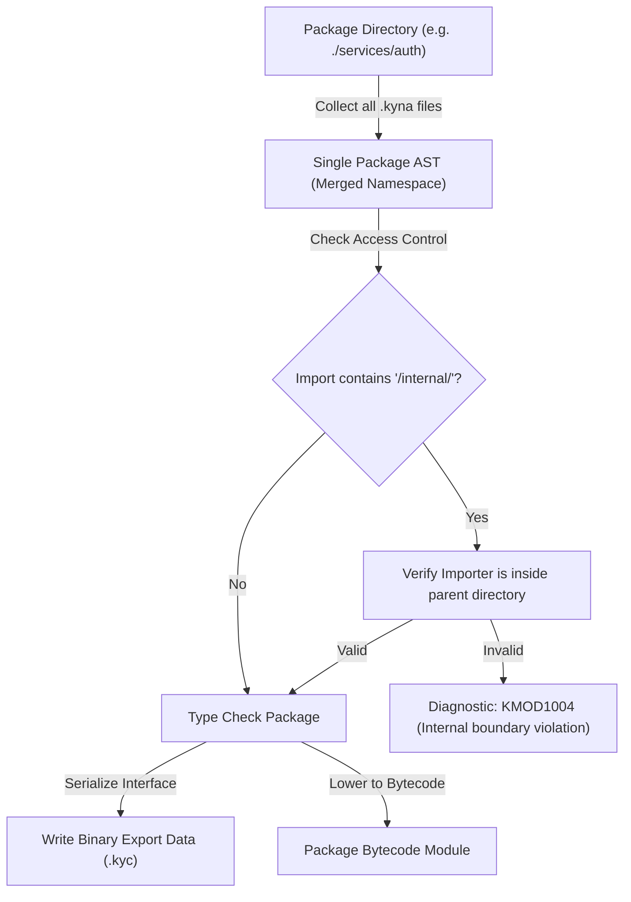

# 06. Scalable Implementation Plans for Kyna

Based on our in-depth research into the Go language repository (`/Users/ahmedmansour/Documents/go`), this document outlines four concrete, phased engineering plans to implement Go's scalable architecture inside Kyna.

---

## Plan A: Package & Module Architecture Overhaul

### Objective
Transform Kyna from a script-centric single-file runner into a package-based language supporting multi-file compilation units, compiler-enforced `internal/` encapsulation, and fast incremental builds.



### Technical Deliverables
1. **Multi-File Package Resolution**:
   - Update `tools/kyna_cli/src/command/run_command.cpp` and `check_command.cpp` to accept directory paths in addition to file paths (`ky run ./mypackage`).
   - When a directory is targeted, collect all `.kyna` files (excluding `*_test.kyna`), parse them in parallel, and merge their declarations into a single package scope.
2. **Compiler-Enforced `internal/` Boundary Rule**:
   - In `compiler/kyna_typecheck/src/checkers/module_analyzer.cpp`, inspect the resolved filesystem path of every `import` declaration.
   - If `/internal/` appears in the path, extract the parent directory of `internal`. Verify that the importing file's canonical directory begins with this parent path.
   - If the check fails, report diagnostic:
     ```text
     error [KMOD1004]: use of internal module 'services/auth/internal/crypto' not allowed from 'api/handler.kyna'
     ```
3. **Module Export Data Caching**:
   - Add a lightweight binary serializer for `compiler/kyna_symbols` to emit `.kyc` headers containing only exported function signatures and struct types.
   - Subsequent compilations load the `.kyc` header in $< 1\text{ms}$ instead of re-parsing source text.

---

## Plan B: Type System Modernization (`types2` Architecture)

### Objective
Replace Kyna's lightweight string-based `TypeRef` model with a robust, polymorphic type object graph inspired by Go's `cmd/compile/internal/types2`, introducing tri-color cycle detection and formal method sets.

### Technical Deliverables
1. **Polymorphic Type Graph (`compiler/kyna_types`)**:
   Refactor `compiler/kyna_types/include/kyna/semantics/type_model.hpp` into a class hierarchy:
   ```cpp
   namespace kyna::semantics {
   class Type {
   public:
       virtual ~Type() = default;
       virtual const Type* underlying() const = 0;
       virtual std::string str() const = 0;
       virtual bool is_identical(const Type* other) const = 0;
       virtual bool assignable_to(const Type* target, std::string* reason) const = 0;
   };
   }
   ```
2. **Tri-Color Dependency Checking (`compiler/kyna_typecheck`)**:
   Implement Go's declaration checking algorithm in `compiler/kyna_typecheck/src/checkers/type_checker.cpp`:
   - Maintain a checking stack: `std::vector<Symbol*> obj_path;` and state map: `enum State { White, Grey, Black };`.
   - Before checking symbol `S`, mark `Grey` and push onto `obj_path`.
   - If an uncompleted (`Grey`) dependency is encountered without an indirection (e.g., recursive direct struct embedding), fail immediately with a cycle diagnostic.
   - When checking succeeds, pop and mark `Black`.
3. **Method Set Calculation & Structural Satisfaction**:
   - Implement `lookup.cpp` to calculate the complete method set of any type (including embedded structs).
   - In `interface_checker.cpp`, verify interface implementation via structural method set subset matching:
     $\text{Methods}(\text{Interface}) \subseteq \text{Methods}(\text{Target})$.

---

## Plan C: Universal Streaming & Concurrency Architecture

### Objective
Introduce universal streaming interfaces (`Reader`, `Writer`) and structured lifecycle propagation (`Context`) across Kyna's standard library and host adapters.

### Technical Deliverables
1. **Universal Streaming Seam in `library/core`**:
   - Define canonical `Reader` and `Writer` interfaces in Kyna's core standard library.
   - Implement streaming byte buffers, file streams, and HTTP socket streams complying with `Reader` and `Writer`.
   - Provide `io.copy(writer, reader, buffer_size)` in native C++ (`runtime/kyna_host`), enabling efficient file copy, HTTP upload/download, and pipe processing with fixed $O(1)$ memory consumption.
2. **Context Propagation Seam**:
   - Add `kyna.context` with `Context`, `WithTimeout(ctx, duration)`, and `WithCancel(ctx)`.
   - Thread context handles through `db.query` and `http.fetch`. When a timeout fires or context is canceled, abort the underlying libcurl transfer or PostgreSQL query immediately.

---

## Plan D: Systematic Standard Library Expansion

### Objective
Implement the highest-priority standard library packages identified in the Go gap analysis, strictly adhering to Kyna's `AGENTS.md` clean-code guidelines and 4-point registration invariant.

### The 4-Point Registration Invariant (AGENTS.md)
Every newly added standard library native must be registered in all 4 required locations:
1. `library/core/src/bytecode/bytecode_standard_library.cpp` (VM invocation)
2. `library/core/src/catalog/standard_library_catalog.cpp` (Tree-walk native)
3. `compiler/kyna_symbols/src/catalog/standard_library_symbols.cpp` (Semantic analysis symbols)
4. `tests/tooling/verify_language_examples.py` (Builtin test coverage)

### Phased Roadmap

```text
┌─────────────────────────────────────────────────────────────┐
│ PHASE 1: FOUNDATIONAL UTILITIES                             │
│ • kyna_time: Time, Duration, now(), sleep(Duration)         │
│ • kyna_io: Reader, Writer, Closer, copy(dst, src)           │
└──────────────────────────────┬──────────────────────────────┘
                               │
                               ▼
┌─────────────────────────────────────────────────────────────┐
│ PHASE 2: SECURITY & OBSERVABILITY                           │
│ • kyna_crypto: sha256, sha512, hmac, randomBytes            │
│ • kyna_log: slog.info, slog.warn, slog.error, JSON handler  │
└──────────────────────────────┬──────────────────────────────┘
                               │
                               ▼
┌─────────────────────────────────────────────────────────────┐
│ PHASE 3: CONCURRENCY & NETWORKING                           │
│ • kyna_sync: Mutex, RWMutex, WaitGroup                      │
│ • kyna_net_http: HTTP Server (ListenAndServe), route mux    │
└─────────────────────────────────────────────────────────────┘
```

### Detailed Phase 1 Implementation Blueprint

#### Module 1: `kyna_time`
- **Host Adapter**: `runtime/kyna_host/src/adapters/clock_adapter.cpp` (query monotonic `std::chrono::steady_clock` and wall-time `std::chrono::system_clock`).
- **Standard Library Natives**:
  - `timeNow() -> TimeObject`
  - `timeSleep(nanoseconds: int) -> void`
  - `timeFormat(time: TimeObject, layout: str) -> str`
- **Symbols Registered**:
  - `timeNow`: Arity 0, returns `Time`
  - `timeSleep`: Arity 1, accepts `int`, returns `void`
  - `timeFormat`: Arity 2, accepts `(Time, str)`, returns `str`

#### Module 2: `kyna_crypto`
- **Host Adapter**: Integrate SHA-256 and cryptographically secure random bytes in `runtime/kyna_host`.
- **Standard Library Natives**:
  - `cryptoSha256(data: str) -> str`
  - `cryptoRandomBytes(length: int) -> str`
- **Symbols Registered**:
  - `cryptoSha256`: Arity 1, accepts `str`, returns `str`
  - `cryptoRandomBytes`: Arity 1, accepts `int`, returns `str`

---

## Summary of Implementation Order & Verification

| Milestone | Target Component | Expected Outcome | Verification Metric |
| :--- | :--- | :--- | :--- |
| **M1** | Documentation & Architecture Suite | Complete Go study and scalable blueprints committed under `docs/go_architecture_study/` | `python3 build_tools/verify_repository_architecture.py` passes |
| **M2** | `internal/` Boundary Checking | Module analyzer enforces privacy boundaries on imported packages | New unit test in `compiler/kyna_typecheck/tests/` |
| **M3** | Standard Library Phase 1 (`time` & `io`) | Native `timeNow()`, `timeSleep()`, `ioCopy()` operational in tree-walk & bytecode VM | CTest test suite + `verify_language_examples.py` passes |
| **M4** | Type System Upgrades | `Type` object hierarchy and tri-color cycle detection active in semantic checker | `ky check` detects recursive structs and invalid cycles |
