# Go Language Architecture Study & Kyna Scalability Blueprints

## Executive Overview

This study provides an exhaustive technical analysis of the official Go language implementation (`golang/go` source tree at `/Users/ahmedmansour/Documents/go`), examining the structural patterns, coding conventions, type system mechanics, compiler pipeline, and standard library designs that have enabled Go to scale across millions of developers and massive industrial codebases for over 15 years.

Based on these findings, this directory provides concrete architectural blueprints and phased implementation plans to adapt these proven patterns into **Kyna**, making our language compiler, type checker, runtime VM, and standard library significantly more modular, performant, and scalable.

---

## Documents in This Study

| Document | Title & Core Subject | Key Takeaways for Kyna |
| :--- | :--- | :--- |
| [**01. Repository & Package Architecture**](01_repository_and_package_architecture.md) | **Go's Modular Layout & Package System** Analysis of `src/`, `cmd/`, `internal/`, package boundaries, and DAG compilation. | Multi-file packages, compiler-enforced `internal/` access shielding, and unified command dispatching. |
| [**02. File Anatomy, Rules & Conventions**](02_file_anatomy_coding_rules_and_conventions.md) | **Idiomatic Go Code & File Structure** File structure, casing visibility, zero-value usability, receiver rules, and error idioms. | Eliminating keyword bloat via casing visibility, zero-value initialization semantics, and explicit error values. |
| [**03. Type System & Typing Rules Deep Dive**](03_type_system_and_typing_rules_deep_dive.md) | **Type System Engineering (`types2`)** Type objects, structural interfaces, assignability rules, and tri-color cycle detection. | Upgrading Kyna's `TypeRef` to an object graph, structural conformance checking, and stack-based cycle detection. |
| [**04. Data Flow & Compiler Pipeline**](04_data_flow_parameter_passing_and_compiler_pipeline.md) | **IR Passes, Parameter Passing & Export Data** Fat pointers, context propagation, compiler passes (Syntax→IR→SSA→Obj), and Unified IR export. | Parallel package compilation via serialized export data and explicit `Context` propagation. |
| [**05. Standard Library Gap Analysis**](05_standard_library_gap_analysis_and_catalog.md) | **Go Stdlib Audit & Kyna Feature Catalog** Comprehensive catalog of 50+ Go standard library packages mapped against Kyna's current stdlib. | Prioritized inventory of missing core primitives: universal streams (`io.Reader/Writer`), timers, crypto, and channels. |
| [**06. Scalable Implementation Plans for Kyna**](06_scalable_implementation_plans_for_kyna.md) | **Actionable Engineering Blueprints** Four phased engineering plans: Packages (Plan A), Type System (Plan B), Concurrency/IO (Plan C), Stdlib (Plan D). | Phased delivery roadmaps with concrete C++ class contracts, file layouts, and test strategies. |
| [**07. Architecture Audit & Refactoring Blueprint**](07_kyna_architecture_audit_and_refactoring_blueprint.md) | **Critical Weaknesses & Go-Inspired Fixes** 15 architectural defects ranked by severity with exact Go counterpart solutions and phased roadmap. | String-based types, god-functions, dual engine divergence, missing RAII, security holes, and 4-phase fix plan. |
| [**08. File-by-File Deep Audit**](08_file_by_file_deep_audit.md) | **40+ Source Files Audited Line-by-Line** Every compiler, runtime, stdlib, CLI, and SDK file with exact line numbers, code snippets, and Go equivalents. | Concrete code-level evidence for every defect with before/after comparisons. |

---

## Architectural Synthesis: Go vs Kyna

```mermaid
graph TD
    subgraph Go_Architecture ["Go Architecture (golang/go)"]
        G_SRC["src/ (Package Root)"]
        G_PKG["Package (Multi-file DAG)"]
        G_INT["internal/ (Compiler-Enforced Privacy)"]
        G_CMD["cmd/ (Modular Driver + CLI Tools)"]
        G_COMP["cmd/compile (Syntax -> types2 -> Unified IR -> Walk -> SSA -> Obj)"]
        G_EXP["Export Data (Incremental Parallel Builds)"]
        G_STDLIB["50+ Deep Standard Packages (io, net/http, sync, time, crypto)"]
    end

    subgraph Kyna_Current ["Kyna Current Architecture"]
        K_MOD["CMake Subsystem Modules (kyna_*)"]
        K_SRC["One-thing-per-file domain folders (AGENTS.md)"]
        K_COMP["Compiler Pipeline (Lexing -> Parsing -> TypeCheck -> HIR -> MIR -> Bytecode)"]
        K_TYPE["compiler/kyna_types (TypeRef string-based model)"]
        K_VM["runtime/kyna_vm (Register VM + Tree-walk fallback)"]
        K_STDLIB["5 stdlib modules (core, collections, database, formats, text)"]
    end

    subgraph Scalability_Bridge ["Kyna Scalability Upgrades"]
        B1["Plan A: Multi-file Packages & internal/ Boundaries"]
        B2["Plan B: Object-Oriented Type Graph & Tri-color Cycle Detection"]
        B3["Plan C: Universal io.Reader/Writer & Context Propagation"]
        B4["Plan D: Systematic Stdlib Expansion (sync, time, crypto, net)"]
    end

    Go_Architecture -.->|Informs & Modernizes| Scalability_Bridge
    Scalability_Bridge ==>|Upgrades| Kyna_Current
```

---

## Core Principles to Adopt in Kyna

1. **Explicit Boundaries, Zero Ambiguity**:
   Go avoids magic. All dependencies form a strict Directed Acyclic Graph (DAG); circular imports are hard errors. Kyna will enforce package DAGs and export interfaces.
2. **Encapsulation via `internal/`**:
   In Go, any package nested inside an `internal/` directory is strictly forbidden from being imported by code outside that directory's immediate ancestor tree. Kyna can enforce this rule at semantic analysis time.
3. **Types as Objects, Not Strings**:
   Go's `cmd/compile/internal/types2` models types as a rich polymorphic type graph (`Basic`, `Struct`, `Interface`, `Named`, `Signature`, `Pointer`, `Slice`, `Map`, `Tuple`). Kyna will transition from simple `TypeRef` names to a true semantic type model.
4. **Interfaces as Small Behavioral Contracts**:
   The power of Go lies in single-method interfaces (`io.Reader`, `io.Writer`, `fmt.Stringer`, `error`). Kyna's standard library and object model will adopt these foundational contracts.
5. **Zero-Value Usability**:
   Designing types so that a default-initialized zero value is valid and immediately ready to use avoids cumbersome factory boilerplate and prevents null dereference bugs.
6. **Unified Export Data**:
   By writing serialized binary type and inline signatures per package, downstream packages only parse direct dependencies, allowing compilation times to remain linear and fast.
