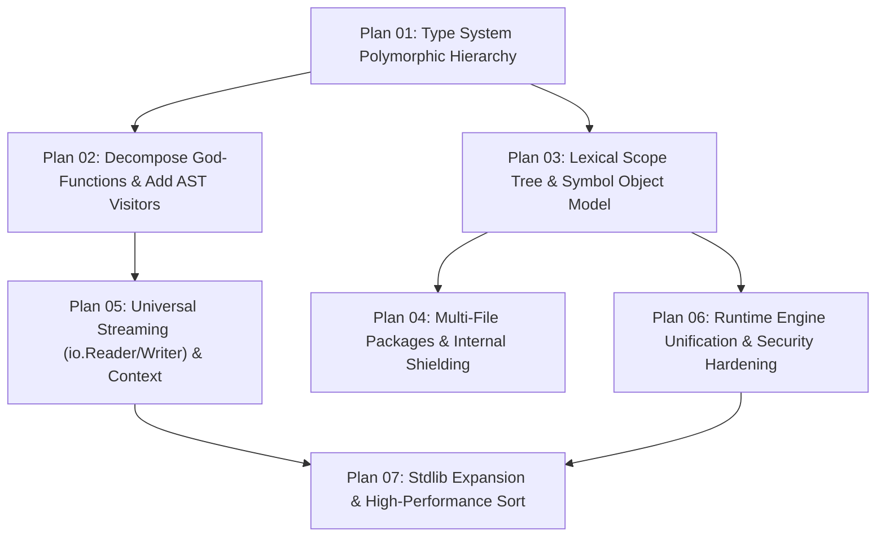

# Kyna Scalability & Architecture Overhaul: Master Implementation Plans

This directory contains executable, phased engineering plans to refactor Kyna's architecture, eliminate technical debt, and adopt Go's production-grade patterns.

---

## Phased Execution Roadmap

---

## Detailed Plan Inventory

| Plan | Title | Scope & Target Files | Go Reference Pattern |
| :--- | :--- | :--- | :--- |
| [**Plan 01**](plan_01_type_system_polymorphic_hierarchy.md) | **Type System Polymorphic Hierarchy** | `compiler/kyna_types/`, `compiler/kyna_typecheck/` | `go/types.Type`, `Basic`, `Signature`, `Named`, `Universe` |
| [**Plan 02**](plan_02_decompose_god_functions_and_visitors.md) | **Decompose God-Functions & Add AST Visitors** | `type_checker.cpp`, `statement_checker.cpp`, `kyna_syntax/` | `go/types/expr.go`, `go/types/stmt.go`, `go/ast/walk.go` |
| [**Plan 03**](plan_03_scope_tree_and_symbol_object_model.md) | **Lexical Scope Tree & Symbol Object Model** | `program_analyzer.hpp`, `analyzer.cpp`, `kyna_typecheck/` | `go/types.Scope`, `go/types.Object`, RAII `EnvironmentGuard` |
| [**Plan 04**](plan_04_multi_file_packages_and_internal_shielding.md) | **Multi-File Packages & Internal Shielding** | `tools/kyna_cli/`, `kyna_parsing/`, `compiler/kyna_hir/` | Go multi-file packages, `internal/` compiler-enforced boundary |
| [**Plan 05**](plan_05_universal_streaming_and_cancellation.md) | **Universal Streaming & Context Cancellation** | `runtime/kyna_host/`, `library/core/` | `io.Reader`, `io.Writer`, `context.Context` |
| [**Plan 06**](plan_06_runtime_unification_and_security.md) | **Runtime Engine Unification & Security Hardening** | `runtime/kyna_vm/`, `library/core/src/bytecode/` | Single execution model, `os/exec.Command` arg vector safety |
| [**Plan 07**](plan_07_stdlib_expansion_and_high_performance_sort.md) | **Stdlib Expansion & High-Performance Sort** | `library/core/`, `compiler/kyna_symbols/` | `slices.Sort` (introsort), `time`, `sync`, `crypto` |
| [**LLM Master Prompt**](LLM_IMPLEMENTATION_PROMPT.md) | **Master Prompt for AI / LLM Implementation** | Repository-wide | Comprehensive prompt for an LLM to execute these plans systematically |

---

## Core Invariants

1. **4-Point Registration Invariant**: Every newly added callable standard library primitive must be registered across all 4 touchpoints:
   - Bytecode VM invocation (`library/core/src/bytecode/bytecode_standard_library.cpp`)
   - Tree-walk interpreter catalog (`library/core/src/catalog/standard_library_catalog.cpp`)
   - Semantic symbol catalog (`compiler/kyna_symbols/src/catalog/standard_library_symbols.cpp`)
   - Example and test suite verifier (`tests/tooling/verify_language_examples.py`)
2. **Zero Legacy Naming**: All files, paths, and comments must use the language name `Kyna`.
3. **Explicit CMake Source Discovery**: No `GLOB` or `GLOB_RECURSE`. Every newly created file must be explicitly registered in the owning module's `CMakeLists.txt`.
4. **Domain Subfolder Isolation**: Implementation files under `src/` must live in domain subfolders (`types/`, `validators/`, `checkers/`, `lowering/`, etc.).
