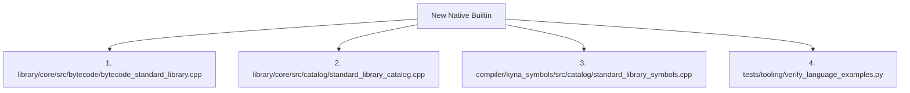

# Plan 07: Stdlib Expansion & High-Performance Sort

> **Goal**: Replace the $O(n^2)$ standard library bubble sort with $O(n \log n)$ introsort, and systematically expand standard library capabilities (time, sync, crypto) adhering to the 4-point registration rule.
> **Inspiration**: Go's `slices.Sort`, `time`, `sync`, and `crypto`.

---

## 1. Problem Statement & Root Cause

1. **Suboptimal Standard Library Sort**:
   In `library/core/src/catalog/collections_library.cpp:L67-L114`, the standard library's `sort` is implemented as an $O(n^2)$ bubble sort. Sorting a list of 5,000 items takes seconds and hangs the process on larger collections.
2. **Missing Core Systems Primitives**:
   Kyna lacks high-resolution monotonic time, structured durations, concurrency locks/wait groups, and cryptographic hashing.

---

## 2. Target Architecture

### 2.1 Introsort Implementation for Collections
Replace bubble sort with an $O(n \log n)$ hybrid introsort (quicksort switching to heapsort upon recursion depth limit, and insertion sort for small partitions):

```cpp
// library/core/src/catalog/collections/sort_algorithm.cpp
namespace kyna::library::collections {

void introsort(std::vector<Value>& elements,
               const std::function<bool(const Value&, const Value&)>& comp);

} // namespace kyna::library::collections
```

### 2.2 Phased Standard Library Additions

#### Phase 1: High-Precision Time (`kyna.time`)
- `timeNow() -> int` (monotonic nanoseconds)
- `timeSleep(ms: int)`
- `timeFormat(timestamp: int, layout: str) -> str`

#### Phase 2: Cryptographic Hashing (`kyna.crypto`)
- `cryptoSha256(data: str) -> str`
- `cryptoHmacSha256(key: str, message: str) -> str`
- `cryptoRandomBytes(count: int) -> array`

#### Phase 3: Synchronization Primitives (`kyna.sync`)
- `Mutex` (`lock()`, `unlock()`)
- `WaitGroup` (`add(n)`, `done()`, `wait()`)

---

## 3. The 4-Point Registration Protocol

Every newly added builtin must strictly adhere to the 4-point registration rule specified in `AGENTS.md`:



---

## 4. Implementation Steps

- [ ] **Step 1: Implement `introsort`**
  - Create `library/core/src/catalog/collections/introsort.cpp` and wire into `collections_library.cpp`.
- [ ] **Step 2: Add `timeNow` and `timeSleep` Across All 4 Touchpoints**
  - Add to `bytecode_standard_library.cpp`.
  - Add to `standard_library_catalog.cpp`.
  - Add symbol signatures to `standard_library_symbols.cpp`.
  - Add test example and update `BUILTIN_COVERAGE` in `verify_language_examples.py`.
- [ ] **Step 3: Add `cryptoSha256` Across All 4 Touchpoints**
- [ ] **Step 4: Update Documentation**
  - Document newly added APIs in `docs/stdlib.md`.

---

## 5. Verification Plan

1. **Performance Benchmark**:
   - Run sorting benchmark comparing 10,000 items: target execution time under 5ms.
2. **Language Examples & Tooling Test**:
   - Run `python3 tests/tooling/verify_language_examples.py ./build-debug/bin/ky .`.
3. **Repository Architecture Verifier**:
   - Run `python3 build_tools/verify_repository_architecture.py`.
