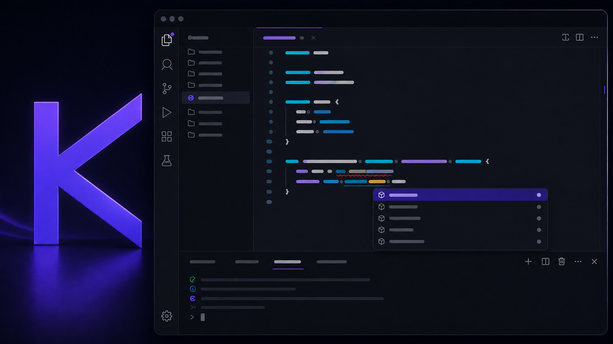
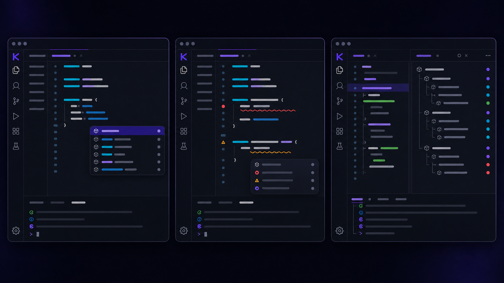

<p align="center">
  
</p>

<h1 align="center">Kyna Language Support</h1>

<p align="center"><strong>Write · Check · Run · Inspect</strong></p>

<p align="center">
  A focused, local-first VS Code experience for the Kyna programming language.
</p>

<p align="center">
  <code>v1.0.12</code>&nbsp;&nbsp;
  <code>VS Code 1.85+</code>&nbsp;&nbsp;
  <code>.kyna</code>&nbsp;&nbsp;
  <code>MIT</code>
</p>

<p align="center">
  <a href="#quick-start">Quick start</a> ·
  <a href="#feature-showcase">Features</a> ·
  <a href="#commands">Commands</a> ·
  <a href="#configuration">Configuration</a>
</p>



Kyna Language Support is the official editor companion for `.kyna` files. It combines a lightweight native VS Code experience with the real Kyna CLI, so editor diagnostics and inspection output stay aligned with the language implementation.

> **Local-first by design.** Source code stays on your machine. Completion, diagnostics, execution, and compiler inspection use the configured local Kyna CLI.

<table>
  <tr>
    <td width="50%"><strong>✦ Smart editing</strong><br>Highlighting, snippets, contextual completion, symbols, hovers, and definitions.</td>
    <td width="50%"><strong>◆ Live feedback</strong><br>Fast, cancellable compiler diagnostics for the current unsaved buffer.</td>
  </tr>
  <tr>
    <td width="50%"><strong>▶ Native workflow</strong><br>Run and Check actions in CodeLens, the editor toolbar, status bar, and Command Palette.</td>
    <td width="50%"><strong>⌘ Deep inspection</strong><br>Tokens, syntax tree, HIR, MIR, and bytecode in a dedicated output channel.</td>
  </tr>
</table>

<sub>The artwork in this README is an illustrative editor mockup. The extension follows your selected VS Code theme and native editor UI.</sub>

---

<a id="quick-start"></a>

## 🚀 Quick start

### Requirements

- Visual Studio Code 1.85 or newer
- A Kyna CLI executable, either installed on `PATH` or built inside the current workspace

The extension searches common CMake output directories—including `build-debug`, `build-release`, and `build-sanitizers`—for `ky` first and the `kyna` 1.x compatibility alias second. It then falls back to `ky` on `PATH`. You can always select a specific binary with the compatibility setting `kyna.executable`.

### Install

Install the CLI globally for the current user without cloning the repository:

```sh
curl -fsSL https://github.com/Up-to-code/Kyna/releases/latest/download/install.sh | sh
```

```powershell
irm https://github.com/Up-to-code/Kyna/releases/latest/download/install.ps1 | iex
```

From a source checkout, install the CLI and extension together:

```sh
make install-all
```

To install only the VS Code extension:

```sh
make vscode-install
```

You can also package and install the VSIX manually:

```sh
make vscode-package
code --install-extension editors/vscode-kyna/kyna-language-support-1.0.12.vsix --force
```

### Start coding

Open or create a `.kyna` file:

```kyna
func greet(name: str): str {
    return "Hello " + name;
}

let visits: int = 1;
visits = visits + 1;

set audience = if (visits > 1) {
    "returning visitor"
} else {
    "new visitor"
};

console.log(greet("Kyna"), audience);
```

The editor immediately enables Kyna highlighting, comments, snippets, completion, symbols, hovers, definitions, CodeLens actions, and live compiler diagnostics.

Open `kyna.toml` to use the project toolbar, or select the purple Kyna activity-bar icon. The Project panel shows the active project and provides one-click Run, Dev, dependency installation, route generation, backend configuration, and manifest navigation.

The Routes panel groups endpoints by method. Generate static, homepage, `:slug`, or nested multi-parameter routes; click the file icon to edit the handler or the globe icon to open the live endpoint. Route generation saves pending editors before updating the registry, preventing an older unsaved `index.kyna` from hiding a new route.

Formatting is provided by the same local CLI used for diagnostics. Run **Format Document** normally or enable it on save:

```json
{
  "[kyna]": { "editor.formatOnSave": true }
}
```

---

<a id="feature-showcase"></a>

## ✨ Feature showcase



### ✦ Language-aware editing

- Syntax highlighting for the canonical `.kyna` extension
- Python-style `#` line comments and Kyna-aware snippets
- Completion for keywords, primitive types, standard-library functions, and declarations in the current document
- Document symbols, hover descriptions, and same-file definitions

### ◆ Imports and contextual completion

- Relative `.kyna` path completion inside `import "..."`
- Exported-member completion after an imported namespace such as `math.`
- Namespace-specific operations after `http.`, `json.`, `toml.`, `xml.`, `fs.`, `process.`, `os.`, `terminal.`, `db.`, and `collections.`
- Inferred response members after `fetch` or `http.fetch`
- Safe-result members—`ok`, `response`, and `error`—after `fetchResult` or `http.tryFetch`

Completion retriggers automatically after `.`, `"`, and `/`.

### ◇ Backend projects

`kyna.toml` has dedicated syntax highlighting, completions, and a manifest icon. Generated backend projects use an Express-style composition:

```text
src/main.kyna → src/app.kyna → src/routes/index.kyna → route modules
```

The official injected `http` namespace creates the application. `app.get`, `post`, `put`, `patch`, `delete`, `use`, and `listen` receive contextual completion. Imports such as `import "./routes/users.kyna" as usersRoute;` receive path completion, exported-member completion, and cross-file Go to Definition.

Run **Kyna: Generate Route** or use the CLI to create and register a route without hand-editing the registry:

```sh
ky generate route users
ky generate route users --method post --path /api/users
ky generate route user-detail --path /teams/:team/users/:user
```

The Kyna sidebar separates project information from a native **Routes** view. Routes are grouped by HTTP method, use method-specific colors, show their handler file and named parameters, and open the handler on click. The route wizard offers static, single-parameter, nested-parameter, and custom path shapes. Generated handlers expose `request.params` and `request.query`.

### ⚡ Live diagnostics

The extension checks an unsaved buffer 250 ms after editing and publishes compiler errors and warnings directly in VS Code. An older checker process is cancelled when the document changes again, preventing stale diagnostics from replacing newer results.

Live checking sends the current buffer to the local CLI over standard input and supplies the real source path so relative imports still resolve. No temporary source file is written.

### ▶ Run and Check

Use the editor-title buttons, CodeLens actions, status bar, or Command Palette to run the active file:

- **Kyna: Run File** saves and executes the active program.
- **Kyna: Check File** saves and type-checks the active program without running it.

Both commands launch Kyna directly through a managed VS Code task. Output remains visible in a dedicated terminal, compiler colors are preserved, and stale Run/Check terminals are replaced before a new launch.

---

<a id="commands"></a>

## ⌘ Commands

### Project workflows

| Command | Action |
| --- | --- |
| `Kyna: Run Project` | Run the nearest `kyna.toml` entry point. |
| `Kyna: Watch & Restart Development Server` | Watch, check, and restart the backend. |
| `Kyna: Install Project Dependencies` | Resolve Git and local dependencies. |
| `Kyna: Generate Route` | Create a route module and register it in `routes/index.kyna`. |
| `Kyna: Configure Backend` | Set the manifest host and port with validated prompts. |
| `Kyna: Open Project Manifest` | Open the nearest `kyna.toml`. |
| `Kyna: Open Routes Folder` | Reveal the project route modules in Explorer. |

### Inspect the compiler pipeline

The Command Palette exposes the same inspection stages as the CLI:

| Command | Output |
| --- | --- |
| `Kyna: Show Tokens` | Lexer token stream |
| `Kyna: Show Syntax Tree` | Parsed syntax tree |
| `Kyna: Show HIR` | Resolved high-level intermediate representation |
| `Kyna: Show MIR` | Verified mid-level intermediate representation |
| `Kyna: Show Bytecode` | Validated register-bytecode disassembly |

Inspection results appear in the **Kyna Compiler** output channel.

---

<a id="configuration"></a>

## ⚙️ Configuration

| Setting | Default | Description |
| --- | --- | --- |
| `kyna.executable` | Empty | Absolute path or command name for the Kyna CLI. Empty auto-detects `ky`, then the `kyna` compatibility alias. |

Example workspace setting:

```json
{
  "kyna.executable": "/absolute/path/to/ky"
}
```

---

## 🛠 Develop the extension

Launch an Extension Development Host from the repository root:

```sh
code --extensionDevelopmentPath="$PWD/editors/vscode-kyna"
```

Verify and rebuild the package:

```sh
python3 build_tools/verify_vscode_extension.py
make vscode-package
```

The package includes the syntax grammar, snippets, icons, README artwork, documentation, and runnable Kyna examples.

---

## 🔒 Privacy and security

The extension has no telemetry and sends no source code to an extension-owned service. All checking, execution, and inspection happens through the configured local Kyna executable.

Running a Kyna program may use its filesystem, process, network, or database capabilities. Review untrusted source before running it. Report vulnerabilities through the repository's private process in [SECURITY.md](https://github.com/Up-to-code/Kyna/blob/main/SECURITY.md), not through a public issue.

---

## License

Kyna Language Support is available under the [MIT License](LICENSE).
